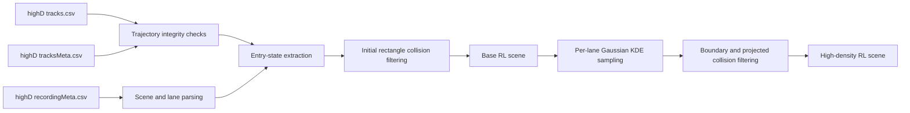

# HighD-SceneForge

A highD preprocessing and traffic-density augmentation toolkit for reinforcement learning scene construction.

HighD-SceneForge extracts the state of each vehicle when it enters the road, constructs scene and lane state representations, removes incomplete trajectories and vehicles with conflicting initial bounding boxes, and generates reproducible high-density vehicle entry events using Gaussian kernel density estimation (Gaussian KDE).

> This repository contains processing code only. It does not include the original highD dataset, processed CSV files, road background images, or trained models. Users must obtain highD separately and comply with its license terms.

## Features

- Preserve each vehicle's entry position, dimensions, velocity, acceleration, lane, and class.
- Parse road geometry, lane boundaries, driving direction, and recording metadata from `recordingMeta`.
- Calculate per-lane vehicle count, mean speed, speed standard deviation, density, and occupancy at each vehicle entry frame.
- Remove trajectories with discontinuous frames, inconsistent static metadata, mid-road appearances, or premature disappearances.
- Detect entry conflicts using axis-aligned rectangles constructed from vehicle length and width.
- Sample entry frames, velocities, and vehicle dimensions per lane with Gaussian KDE to increase traffic density.
- Apply lane-boundary constraints and constant-velocity projected collision filtering to synthetic vehicles.
- Provide a command-line interface, Python API, deterministic random seeds, and unit tests.

## Processing Pipeline



## Installation

Python 3.10 or later is recommended.

```bash
git clone https://github.com/lufyang1/HighD-SceneForge.git
cd HighD-SceneForge
python -m pip install -e .
```

Install development dependencies with:

```bash
python -m pip install -e ".[dev]"
```

## Preparing highD Files

Obtain the dataset from the [official highD website](https://www.highd-dataset.com/). Each recording requires the following three files:

```text
highD-data/
|-- 01_tracks.csv
|-- 01_tracksMeta.csv
`-- 01_recordingMeta.csv
```

Road background images are not required. HighD-SceneForge never modifies or copies the source highD files.

## Quick Start

### Build and augment a scene in one command

The following command builds a base scene for recording 01 and attempts to add 50% more vehicles relative to the base vehicle count in each lane:

```bash
highd-sceneforge pipeline \
  --data-dir /path/to/highD-data \
  --recording-id 01 \
  --output-dir output \
  --additional-density 0.5 \
  --seed 42
```

Windows PowerShell example:

```powershell
highd-sceneforge pipeline `
  --data-dir "D:\datasets\highD\data" `
  --recording-id 01 `
  --output-dir "output" `
  --additional-density 0.5 `
  --seed 42
```

`--additional-density 0.5` requests additional vehicles equal to 50% of the base entry count in each lane. It does not set the final vehicle count to 50% of the original. Collision filtering may prevent some requested vehicles from being inserted; the actual counts are recorded in `augmentation_report.json`.

### Build and clean a base scene only

```bash
highd-sceneforge build \
  --tracks /path/to/01_tracks.csv \
  --tracks-meta /path/to/01_tracksMeta.csv \
  --recording-meta /path/to/01_recordingMeta.csv \
  --output-dir output/scene_01
```

### Augment an existing scene

```bash
highd-sceneforge augment \
  --scene-dir output/scene_01 \
  --output-dir output/scene_01_augmented \
  --additional-density 1.0 \
  --seed 42
```

`--additional-density 1.0` requests as many additional vehicles as there are base vehicles, targeting approximately twice the original scene population.

## Output Files

The base scene directory contains:

| File | Description |
|---|---|
| `vehicle_entries.csv` | Entry states of vehicles that passed the cleaning filters |
| `lane_states.csv` | Per-lane traffic state at every vehicle entry frame |
| `rejected_vehicles.csv` | Rejected vehicle IDs and rejection reasons |
| `scene.json` | Recording metadata, lane definitions, configuration, and processing summary |

The augmented scene directory contains:

| File | Description |
|---|---|
| `vehicle_entries_augmented.csv` | Original and synthetic vehicle entry states |
| `scene_augmented.json` | Scene metadata and augmentation summary |
| `augmentation_report.json` | Requested, accepted, and rejected candidate counts and achieved density multiplier |
| `lane_entry_counts.csv` | Real and synthetic entry counts for each lane |

Main fields in `vehicle_entries.csv`:

| Field | Description |
|---|---|
| `frame` | First frame in which the vehicle appears |
| `track_id` | Original highD track ID; synthetic vehicles receive new increasing IDs |
| `bbox_x`, `bbox_y` | Top-left bounding-box coordinates in the highD coordinate system |
| `length`, `width` | Longitudinal vehicle length and lateral vehicle width |
| `x`, `y` | Bounding-box center coordinates |
| `velocity_x`, `velocity_y` | Velocity at scene entry |
| `acceleration_x`, `acceleration_y` | Acceleration at scene entry |
| `lane_id` | highD lane ID |
| `vehicle_class` | `Car` or `Truck` |
| `is_synthetic` | Whether the entry was generated by Gaussian KDE |

## Trajectory Cleaning Rules

By default, a trajectory must satisfy all of the following conditions:

1. Frame numbers are continuous.
2. The first frame, last frame, and frame count in the track CSV agree with `tracksMeta`.
3. Unless it appears in the first recording frame, the vehicle must enter from the correct road edge for its driving direction.
4. Unless it remains visible through the last recording frame, the vehicle must leave through the correct road edge for its driving direction.
5. The vehicle's length-width rectangle at its first frame must not overlap an already active vehicle rectangle.

Rules 3 and 4 remove interrupted detections and trajectories that abruptly appear or disappear in the middle of the road. Vehicles already present when recording begins, or still present when recording ends, are not rejected solely because of the recording boundary.

Common configuration options:

```text
--road-length 420
--edge-margin 10
--collision-margin 0
--allow-incomplete-exit
```

Use `--allow-incomplete-exit` to disable the exit-edge check when only vehicle entry states are needed.

## Gaussian KDE Density Augmentation

Augmentation is performed independently for each lane:

1. Estimate distributions for entry frame, longitudinal velocity, lateral velocity, and vehicle dimensions from cleaned real entry events.
2. Generate candidate vehicles with Gaussian KDE. When the sample is too small or its covariance is degenerate, fall back to bounded Gaussian sampling.
3. Place each candidate at the correct road entrance for the lane's driving direction and constrain its lateral position to the lane boundaries.
4. Project previously entered vehicles with a constant-velocity model and reject candidates that cause a rectangle collision or violate the configured clearance.
5. Store the random seed, requested count, accepted count, rejected count, and achieved density multiplier for reproducibility.

This augmentation method is intended for constructing reinforcement learning stress-test scenarios. It does not attempt to recover real vehicles that were unobserved in highD. Synthetic vehicles contain entry states only; subsequent trajectories should be produced by a simulation environment or vehicle dynamics model.

## Python API

```python
from highd_sceneforge import AugmentConfig, SceneBuildConfig, augment_scene, build_scene

build_scene(
    tracks_path="/path/to/01_tracks.csv",
    tracks_meta_path="/path/to/01_tracksMeta.csv",
    recording_meta_path="/path/to/01_recordingMeta.csv",
    output_dir="output/scene_01",
    config=SceneBuildConfig(road_length_m=420.0, edge_margin_m=10.0),
)

augment_scene(
    scene_dir="output/scene_01",
    output_dir="output/scene_01_augmented",
    config=AugmentConfig(additional_density=0.5, seed=42),
)
```

## Testing

The tests use small DataFrames generated in code and do not contain highD data.

```bash
pytest
```

## Data Protection

The repository's `.gitignore` excludes common data directories, all CSV and pickle files, road background images, model files, and generated outputs. Before committing, it is still good practice to run:

```bash
git status --short
git ls-files
```

Confirm that only source code, tests, and documentation are tracked.

## Dataset Citation

When using highD in research, obtain it under the terms stated by its maintainers and cite the original dataset paper:

> Krajewski, R. et al. The highD Dataset: A Drone Dataset of Naturalistic Vehicle Trajectories on German Highways for Validation of Highly Automated Driving Systems. ITSC, 2018.

HighD-SceneForge is an independent data-processing tool and is not affiliated with the highD dataset maintainers.

## License

The source code is released under the [MIT License](LICENSE). The highD dataset is not covered by this repository's MIT License.
