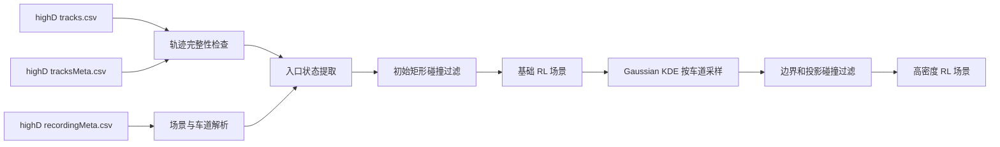

# HighD-SceneForge

面向强化学习场景构建的 highD 数据预处理与交通密度扩充工具。

HighD-SceneForge 从用户本地的 highD CSV 文件中提取车辆进入道路时的状态，构建场景和车道状态，清除不完整轨迹及初始包围框冲突车辆，并通过高斯核密度估计（Gaussian KDE）生成可复现的高密度车辆入口事件。

> 本仓库只包含处理代码，不包含 highD 原始数据、处理后的 CSV、道路背景图或训练模型。使用者需要自行申请 highD 数据并遵守其许可条款。

## 功能

- 保留每辆车进入场景时的位置、尺寸、速度、加速度、车道和车辆类别。
- 从 `recordingMeta` 解析道路、车道边界、行驶方向和场景元数据。
- 在每个车辆进入时刻统计各车道车辆数、平均速度、速度标准差、密度和占有率。
- 清除帧不连续、静态元数据不一致、从道路中部突然出现或提前消失的轨迹。
- 使用车辆长宽形成的轴对齐矩形检查进入场景时的包围框碰撞。
- 按车道使用 Gaussian KDE 采样进入时刻、速度及车辆长宽，提高场景拥挤度。
- 对合成车辆执行边界约束和基于匀速投影的入口碰撞过滤。
- 提供命令行接口、Python API、固定随机种子和单元测试。

## 处理流程



## 安装

建议使用 Python 3.10 或更高版本。

```bash
git clone https://github.com/lufyang1/HighD-SceneForge.git
cd HighD-SceneForge
python -m pip install -e .
```

安装开发依赖：

```bash
python -m pip install -e ".[dev]"
```

## highD 文件准备

从 [highD 官方网站](https://www.highd-dataset.com/) 获取数据。每个 recording 需要以下三个文件：

```text
highD-data/
├── 01_tracks.csv
├── 01_tracksMeta.csv
└── 01_recordingMeta.csv
```

道路背景图不是必需输入。本项目不会修改或复制原始 highD 文件。

## 快速开始

### 一次完成场景构建和密度扩充

下面的命令先构建 recording 01 的基础场景，再按每条车道基础车辆数的 50% 生成额外车辆：

```bash
highd-sceneforge pipeline \
  --data-dir /path/to/highD-data \
  --recording-id 01 \
  --output-dir output \
  --additional-density 0.5 \
  --seed 42
```

Windows PowerShell 示例：

```powershell
highd-sceneforge pipeline `
  --data-dir "D:\datasets\highD\data" `
  --recording-id 01 `
  --output-dir "output" `
  --additional-density 0.5 `
  --seed 42
```

`--additional-density 0.5` 表示尝试在每条车道增加基础入口车辆数的 50%，不是将总车辆数设置为原来的 50%。碰撞过滤可能使最终增加数量略低于请求值，实际数量记录在 `augmentation_report.json` 中。

### 只构建和清洗基础场景

```bash
highd-sceneforge build \
  --tracks /path/to/01_tracks.csv \
  --tracks-meta /path/to/01_tracksMeta.csv \
  --recording-meta /path/to/01_recordingMeta.csv \
  --output-dir output/scene_01
```

### 对已有场景执行密度扩充

```bash
highd-sceneforge augment \
  --scene-dir output/scene_01 \
  --output-dir output/scene_01_augmented \
  --additional-density 1.0 \
  --seed 42
```

`--additional-density 1.0` 表示尝试额外生成与基础入口车辆数相同的车辆，即目标总量约为基础场景的 2 倍。

## 输出文件

基础场景目录包含：

| 文件 | 内容 |
|---|---|
| `vehicle_entries.csv` | 清洗后车辆进入场景时的状态 |
| `lane_states.csv` | 每个入口时刻的逐车道交通状态 |
| `rejected_vehicles.csv` | 被清除车辆及原因 |
| `scene.json` | recording 信息、车道边界、参数和处理摘要 |

密度扩充目录包含：

| 文件 | 内容 |
|---|---|
| `vehicle_entries_augmented.csv` | 原始入口车辆与合成车辆 |
| `scene_augmented.json` | 场景信息及扩充摘要 |
| `augmentation_report.json` | 请求数量、通过安全过滤的数量和实际密度倍率 |
| `lane_entry_counts.csv` | 各车道真实/合成入口车辆数 |

`vehicle_entries.csv` 的主要字段：

| 字段 | 含义 |
|---|---|
| `frame` | 车辆首次出现的帧 |
| `track_id` | highD 轨迹编号；合成车辆使用新的递增编号 |
| `bbox_x`, `bbox_y` | highD 左上角包围框坐标 |
| `length`, `width` | 车辆纵向长度和横向宽度 |
| `x`, `y` | 包围框中心坐标 |
| `velocity_x`, `velocity_y` | 进入场景时的速度 |
| `acceleration_x`, `acceleration_y` | 进入场景时的加速度 |
| `lane_id` | highD 车道编号 |
| `vehicle_class` | `Car` 或 `Truck` |
| `is_synthetic` | 是否由 Gaussian KDE 生成 |

## 清洗规则

默认情况下，一条轨迹需要同时满足以下条件：

1. 帧编号连续。
2. CSV 中的首尾帧和帧数与 `tracksMeta` 一致。
3. 非第 1 帧出现的车辆必须从对应行驶方向的道路边缘进入。
4. 非录像最后一帧消失的车辆必须从对应道路边缘驶出。
5. 车辆首次出现时的长宽矩形不得与已经存在的车辆矩形重叠。

第 3、4 项用于清除检测中断或突然出现在道路中部的轨迹。录像开始前已经进入道路、或录像结束后仍在道路内的车辆不会仅因为记录边界而被删除。

常用参数：

```text
--road-length 420
--edge-margin 10
--collision-margin 0
--allow-incomplete-exit
```

如只关心车辆进入状态，可使用 `--allow-incomplete-exit` 关闭驶出边界检查。

## Gaussian KDE 密度扩充

扩充过程按车道独立执行：

1. 从清洗后的真实入口事件估计进入帧、纵向速度、横向速度及车辆长宽分布。
2. 通过 Gaussian KDE 生成候选车辆；样本过少或协方差退化时自动回退到受限高斯采样。
3. 根据车道方向将车辆放置在道路入口，并将横向位置限制在车道边界内。
4. 使用已进入车辆的速度进行匀速位置投影，删除会产生矩形碰撞或违反间距约束的候选车辆。
5. 保存随机种子、请求数量、接受数量和最终密度倍率，保证实验可复现。

该扩充方法用于构造强化学习压力测试场景，不用于恢复 highD 中未观测到的真实车辆轨迹。合成车辆只包含入口状态，后续轨迹应由仿真环境或车辆动力学模型生成。

## Python API

```python
from highd_sceneforge import AugmentConfig, SceneBuildConfig, augment_scene, build_scene

build_scene(
    tracks_path="/path/to/01_tracks.csv",
    tracks_meta_path="/path/to/01_tracksMeta.csv",
    recording_meta_path="/path/to/01_recordingMeta.csv",
    output_dir="output/scene_01",
    config=SceneBuildConfig(road_length_m=420.0, edge_margin_m=10.0),
)

augment_scene(
    scene_dir="output/scene_01",
    output_dir="output/scene_01_augmented",
    config=AugmentConfig(additional_density=0.5, seed=42),
)
```

## 测试

测试使用代码生成的微型 DataFrame，不包含 highD 数据。

```bash
pytest
```

## 数据与隐私保护

`.gitignore` 会忽略常见数据目录、所有 CSV、pickle、道路背景图和模型文件。提交前仍建议运行：

```bash
git status --short
git ls-files
```

确认版本控制中只有源码、测试和文档。

## 数据集引用

如在研究中使用 highD，请按照 highD 官方要求申请数据并引用原始数据集论文：

> Krajewski, R. et al. The highD Dataset: A Drone Dataset of Naturalistic Vehicle Trajectories on German Highways for Validation of Highly Automated Driving Systems. ITSC, 2018.

HighD-SceneForge 是独立的数据处理工具，与 highD 数据集维护方无隶属关系。

## License

代码采用 [MIT License](LICENSE)。highD 数据集不受本仓库 MIT License 约束。
